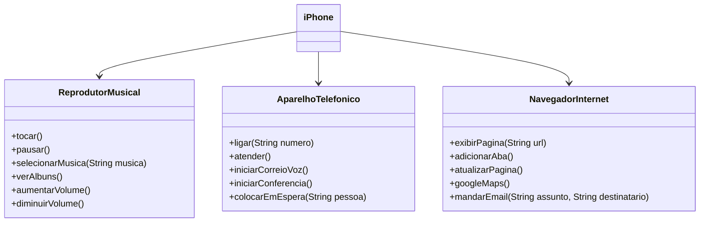

# [DIO](www.dio.me) - Trilha Java Básico

## POO - Desafio

### Modelagem e Diagramação de um Componente iPhone

Neste desafio, modelei e diagramei a representação UML do Iphone(2007), as principais funcionalidades foram: Reprodutor Musical, Aparelho Telefônico e Navegador na Internet.

[Lançamento iPhone 2007](https://www.youtube.com/watch?v=9ou608QQRq8)

### Diagrama UML (Mermaid)

